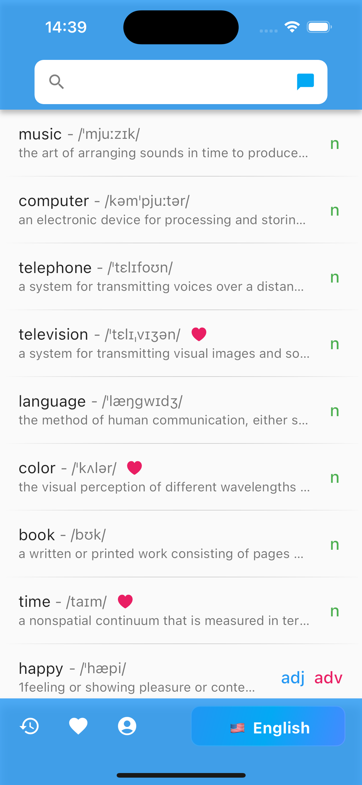
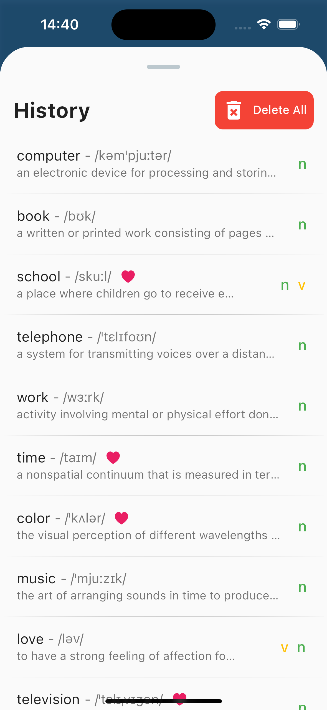
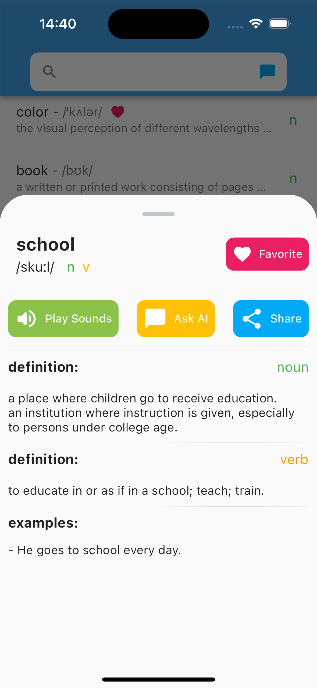
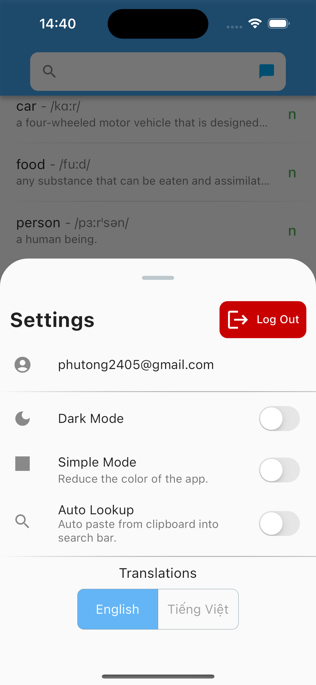
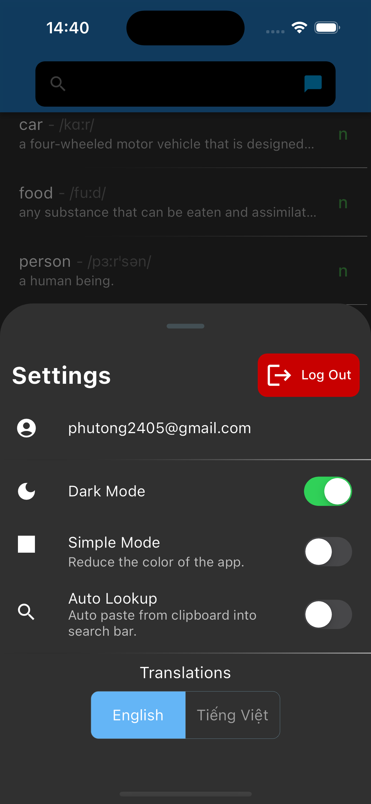
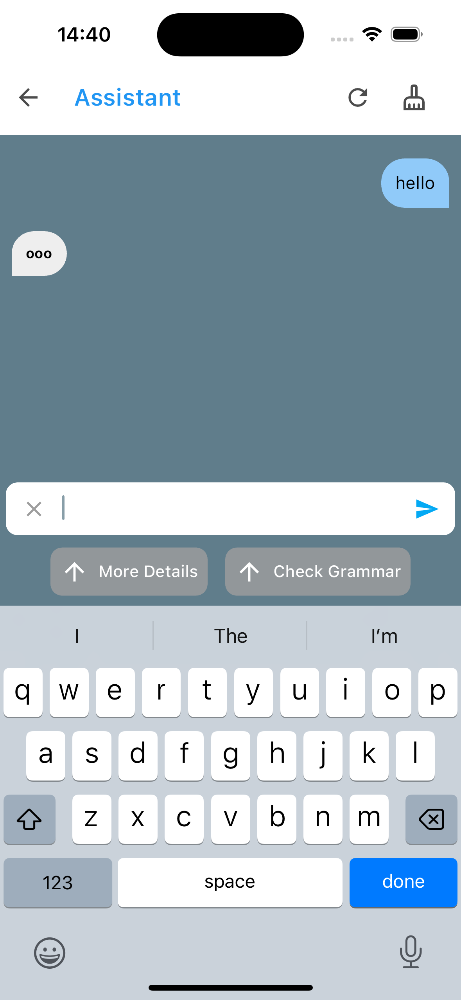
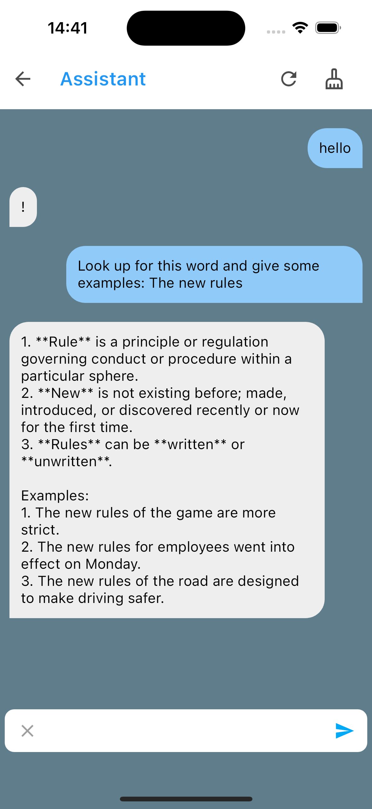

# dictionary_app_1110

This is my very first application - build by Flutter (Bloc).
I have build an app for looking up words, helping people to look up and chat to an assistance to ask things. With a nice and user friendly UX/UI.

---

Features:

- Looking up words.
- Chatting to Google PALM.
- Authentication, login, logout.
- Saving local data for History, Favorites and Settings.
- Dark mode.

Technologies:

- Bloc - state management.
- Http - fetching data.
- Firebase - authentication, storage.
- Hive - saving local data.

---

Views:
There are two screens:

Main Page:

- AppBar: with Searching Bar and Chat Page Button.
- ListView: showing words. (Tap to view detail).
- Bottom Navigation Bar: History Bottom Sheet, Favorite Bottom Sheet, Settings Bottom Sheet, Dictionaries Sheet.

Chat Page:

- AppBar: Back_To_Main_Page Button, Cleaning Button (To clean the messages).
- ListView: showing messages.
- TextField: to type the content. Sending Button (to send message). More Details Button, Check Grammar (to send message with promt).

There are five bottom sheets:

- History Sheet: showing the history, Delete All button (to clean history).
- Favorite Sheet: showing the favorite list.
- Settings Sheet: showing the settings of the app. (In Progressing).
- Dictionaries Sheet: showing the dictionary that user have chosen.
- Item Detail Sheet:
  - Header with the title (the word), with Favorite Button (click to add to Favorite List).
  - ListView: showing the content, meanings, examples.
  - Play Sounds Button (Tap to play sound - In progressing), Ask AI Button (Tap to ask assistant about the word), Share Button (Tap to share - In progressing).

---

Pics

      
